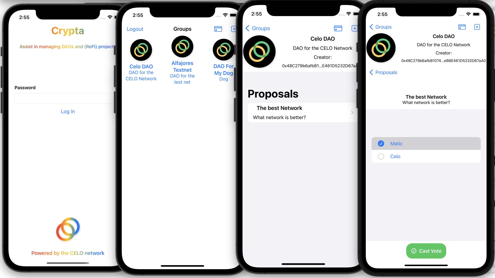

# Crypta

Crypta is a reference app allowing easy integration between smart contracts and iOS apps. For demonstration the app manages a DAO smart contract hosted on the Alfajores Testnet.


---
  * [About](#about)
  * [Requirements](#requirements)
  * [Quick Start](#quick-start)
    + [Crypta iOS App](#crypta-ios-app)
        + [Integrate into your contract](#integrate-into-your-contract)
    + [Smart Contract](#smart-contract)
  * [Resources](#resources)
  * [Components](#components)
    + [ Smart Contract](#smart-contract)
    + [Crypta iOS App](#crypta-ios)
        + [Services](#services)
        + [Contract](#contract)
        + [ABI](#abi)
        + [Contract Address](#contract-address)
    * [Async Calls](#async-calls)
      + [task](#task)
      + [ViewModels](#viewmodels)
  + [Contributing](contributing)
  * [Licence](#licence)

---

## About

This project is a submission for an Gitcoin bounty by the Celo Network. The goal was to develop a native iOS reference application to inspire web3 projects.


## Requirements

- Crypta iOS
    - iOS 15.2+
    - Xcode 13.2.1+
    - Swift 5+
    - Cocoapods


# Quick Start

### Crypta iOS App

1. Open your terminal and Git clone the repo

       git clone https://github.com/MitchTODO/Crypta.git

2. Install Podfile

    - With the same terminal cd into Crypta2.0

       cd Crypta/Crypta2.0

    - Install pods

       pod install

    ***If your running on M1 chip use***

       arch -x86_64 pod install

    Wait for the pods to install

 3. Start Xcode and open up the workspace
     
     - Launch Xcode and select Open a existing project then select the Crypta2.0 workspace
     
     ***Note: You might need to wait for Xcode to process files***
     
     - Build and launch the app

 4. Send Funds to the app

  

  When launching for the first time, you will need to create a new password to generate a wallet. When completed you will be navigated to the `GroupsView`. 
  
  *Note: You will need your password throughout the app to sign/send transactions.*

  Before creating groups and voting you must add some liquidity to the app. This will be used to pay for the gas price associated with writing to the smart contract (ie creating managing groups, proposal and voting).

  1. Navigate over the profile view then press the qr code this will copy your address.

  2. Then with google go to [Alfajores Testnet Faucet](https://celo.org/developers/faucet) and paste your address; then press to send. This will send 1.0 in Celo,cUSD and cEUR.

  3. Press refresh on the app and watch balance be updated.

5. Using the app

    You can now participate in create groups, proposals and voting.


----

### Smart Contract

**Soon to come.**

As of now the contract is deployed on Alfajores Testnet and the ABI is still the same.

      Address: 0xa83453C7fB2D22EbA5d87080C76Ba8fb810349f5


## Resources

[web3swift docs](https://github.com/skywinder/web3swift/blob/develop/Documentation/Usage.md#usage)

[Celo docs](https://docs.celo.org/)

## Components

Project consist of two components the iOS App and Smart contract.

### Smart Contract

The smart contract has a DAO style architecture allowing groups, proposals and voting be created and managed. The contract can be easily extended and is a good starting point.

### Crypta iOS

The app has a simplistic design that can be broken down into three sections services, contract and views.

- Services: variables and async methods that piggy back on the web3swift library.
- Contract: variables that make up the contract, network and wallet.
- Views:    swiftUI views and viewModels that make up the UI

      ├── Contract
      │   ├── ABI
      │   ├── Methods
      │   ├── Tokens
      │   ├── Network
      │   ├── Address
      │   ├── Wallet
      ├── Services
      │   ├── Web3Services
      │   ├── Web3Errors
      │   ├── KeyStoreServices
      ├── Views
          ├── ...

#### Services

The most important class within services is `Web3Services`. This class contains async function used to read and write data from the contract. Also initializes the web3 object to facilitate network settings and `keystoreManager`.

```swift
// Crypta2.0/Services/Web3Services.swift
func readContractMethod(method:ContractMethods,params:[AnyObject],completion:@escaping(Result<[String:Any],Web3Error>) -> Void) {
    DispatchQueue.global().async{ [unowned self] in
        do{

            let walletAddress = EthereumAddress(cryptaWallet.address)
            let contractAddress = EthereumAddress(contractAddress)
            let contractMethod = method.rawValue

            let extraData: Data = Data() // Extra data for contract method
            let contract = w3.contract(contractABI, at: contractAddress, abiVersion: abiVersion)!

            var options = TransactionOptions.defaultOptions

            options.from = walletAddress
            options.gasPrice = .automatic
            options.gasLimit = .automatic

            let tx = contract.read(contractMethod, parameters: params, extraData: extraData, transactionOptions: options)!

            let result = try tx.call()

            completion(.success(result))
        }catch {
            completion(.failure(error as! Web3Error))
        }
    }
}
```

#### Contract

Primarily consisting of files with hard coded strings used as building blocks that make up the contract. The most complex seems to be the contract `ABI`.

#### ABI

The abi allows another program to interact with the contract. Basically a list of all the variables and functions, inputs and outputs that the contract has available. The app needs this to communicate with the contract. The ABI below was copied from the DAO.json file that Truffle created in the build folder.


```swift
// Crypta2.0/Contract/ABI.swift
// MARK: contractABI
let contractABI =
"""
[
    {
      "anonymous": false,
      "inputs": [
        {
          "indexed": false,
          "internalType": "uint256",
          "name": "",
          "type": "uint256"
        }
      ],
      "name": "GroupActivated",
      "type": "event"
    },
    ...
"""
```

#### Contract Address

When contract migrating was successful, it will output the contract address. This address is needed within the app.

```swift
// Crypta2.0/Contract/Address.swift
// DAO contract address uploaded to testnet
let contractAddress = "0xa83453C7fB2D22EbA5d87080C76Ba8fb810349f5"
```


### Async Calls

Sending a async call from views can get messy. Here are couple different ways to that.

#### task

Easy and simple, but only works with swiftUI 15.0+
[Check out the Apple docs on .task](https://developer.apple.com/documentation/swift/task)

```swift
// Crypta2.0/Views/BalanceView.swift
.task {

            Web3Services.shared.getTokenBalance(token: token) { result in
                switch(result){
                case .success(let value):
                    balance = value
                case .failure(let error):
                    self.error = CryptaError(description: error.localizedDescription)
                }
            }
        }
```

#### ViewModels

More complex, but works with order versions and storyboard.

```swift
// Crypta2.0/Views/ProposalViewModel.swift
func createProposal(groupId:BigUInt,proposal:Proposal,choiceOne:String,choiceTwo:String ,password:String, completion:@escaping(TransactionSendingResult) -> Void){
    showProgress = true
    // create params for contract method
    let startTime = Int(proposal.proposalStart)
    let endTime = Int(proposal.proposalEnd)
    let params = [groupId,proposal.title,proposal.description,startTime,endTime,[[0,choiceOne],[0,choiceTwo]]] as [AnyObject]
    // Make call with shared instance
    Web3Services.shared.writeContractMethod(method: .createProposal, params: params, password:password ) {
        result in
        // Update UI on main thread
        DispatchQueue.main.async { [unowned self] in
            showProgress = false
            switch(result) {
            case .success(let tx):
                // Tx was success, save new proposal and add to proposals
                var proposal = proposal

                proposal.id = BigUInt(proposals.count)

                proposal.vote = Vote(hasVoted: false, indexChoice: BigUInt(0))
                proposals.append(proposal)
                completion(tx)
            case .failure(let txError):
                print(txError)
                self.error = CryptaError(description: txError.errorDescription)
            }
        }
    }
}

// Crypta2.0/Views/ProposalView.swift

Button("Create Proposal") {
  contentVM.sendingWriteTx = true
   contentVM.popOverProposal = false

   // Call and wait for successful tx
   // Error is handled back in view model
   proposalVM.createProposal(groupId: selectedGroup.id!, proposal: newProposal, choiceOne: choiceOne, choiceTwo: choiceTwo, password: password) { success in
       // reset proposal object
       newProposal = Proposal()
       choiceOne = ""
       choiceTwo = ""

       selectedGroup.proposalCount! += 1
       // Get ready to show tx
       contentVM.txToShow = success
       contentVM.showPopOverForTx = true
       contentVM.sendingWriteTx = false
   }

}
```


# Contributing

 Know of a better way? I'm all ears! Just remember this project was created to be as cookie cutter as possible.

# Licence
The project is available under [MIT licence](https://github.com/MitchTODO/Crypta/blob/main/LICENSE)
