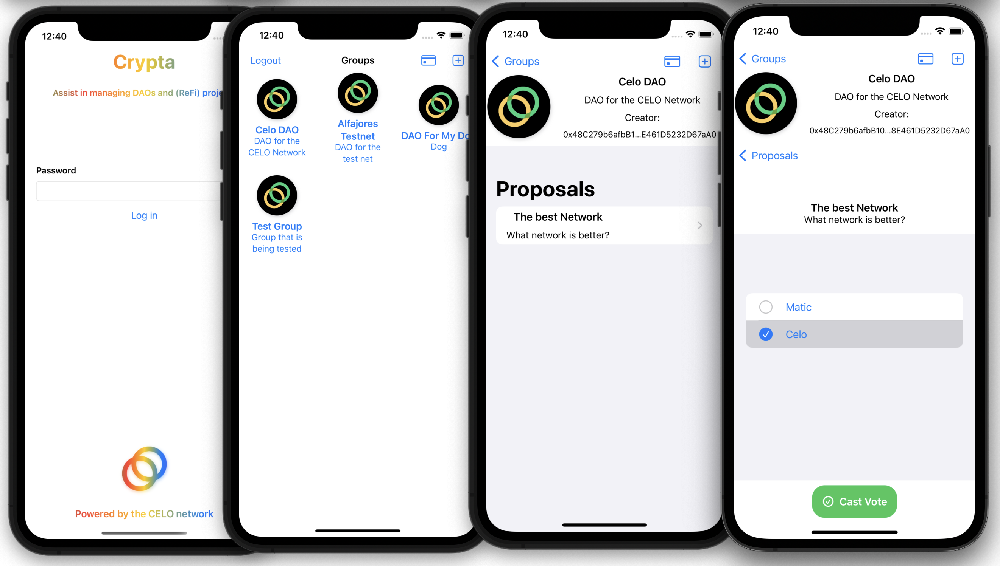
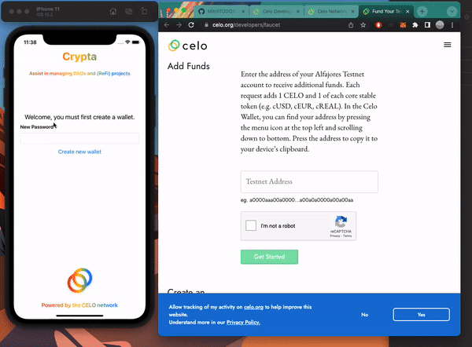
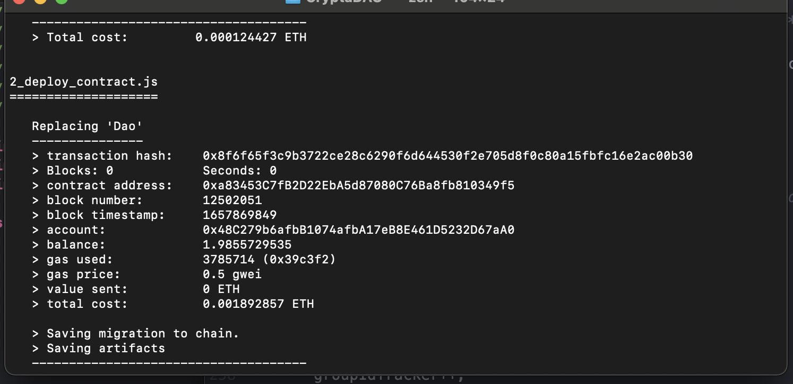
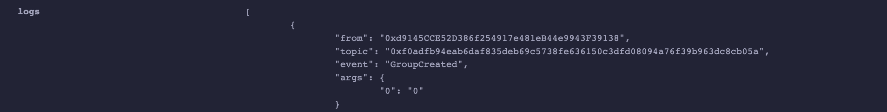
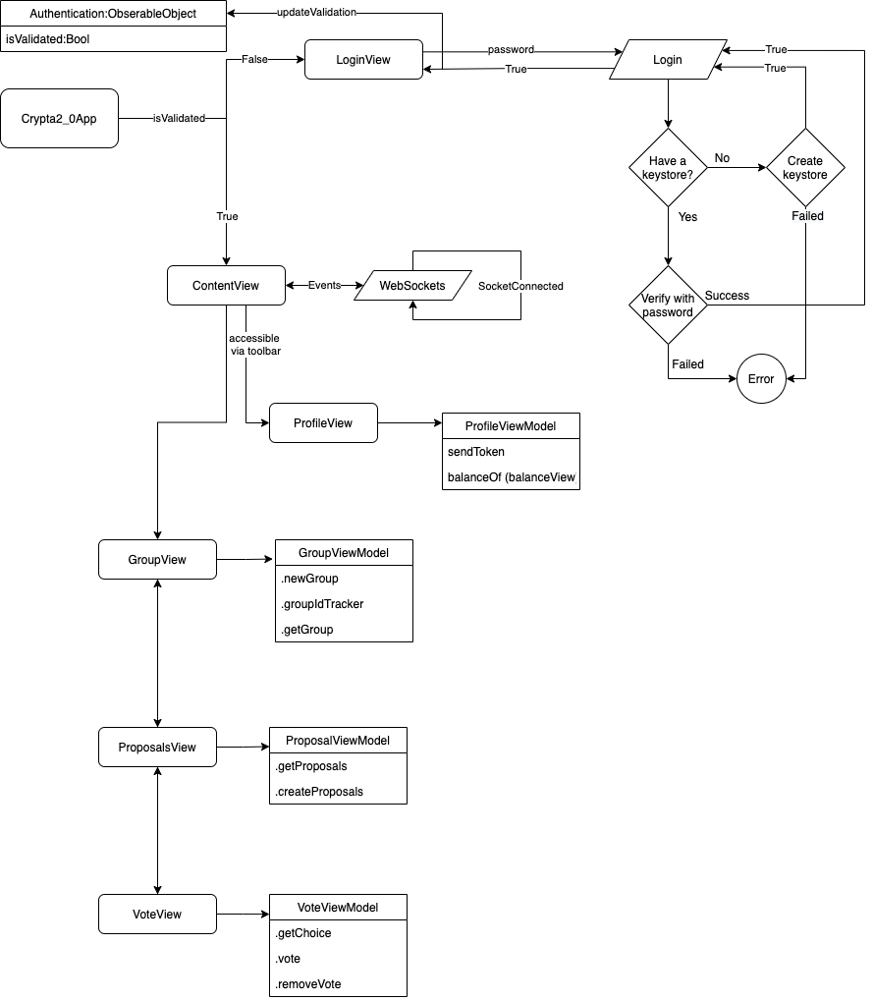
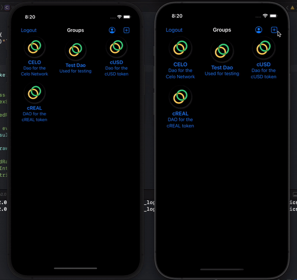

# Crypta

Crypta is a reference iOS app allowing for en easy integration into web3 projects. For demonstration the app manages a DAO smart contract hosted on the Alfajores Testnet.


---
  * [About](#about)
  * [Requirements](#requirements)
  * [Quick Start](#quick-start)
  * [Integration into another contract](#integration-into-another-contract)
    + [Components](#components)
    + [Setting up contract, network and tokens variables](#setting-up-contract,-network-and-tokens-variables)
        + [Contract Address](#contract-address)
        + [Contract ABI](#contract-abi)
        + [Network](#network)
        + [Contract Methods | optional](#contract-methods-|-optional)
        + [Contract Events | optional](#contract-events-|-optional)
        + [Tokens | optional](#tokens-|-optional)
    + [Views](#2.-view-setup)
        * [Async Calls](#async-calls)
          + [task](#task)
          + [ViewModels](#viewmodels)
  * [Resources](#resources)
  * [Smart Contract](#smart-contract)
  * [Contributing](contributing)
  * [Licence](#licence)

---

## About

This project is a submission for an Gitcoin bounty by the Celo Network. The goal was to develop a native iOS reference application to inspire web3 projects.


## Requirements

- iOS 15.2+
- Xcode 13.2.1+
- Swift 5+
- Cocoapods


## Quick Start

**1.** Open your terminal and Git clone the repo

       git clone https://github.com/MitchTODO/Crypta.git

**2.** Install Podfile

  - With the same terminal cd into Crypta2.0

        cd Crypta/Crypta2.0

  - Install pods

        pod install

    ***If your running on M1 chip use***

        arch -x86_64 pod install

  Wait for the pods to install

**3.** Start Xcode and open up the workspace

  - Launch Xcode and select Open a existing project then select the Crypta2.0 workspace.

     ***Note: You might need to wait for Xcode to process files***

  - Build and launch the app.

**4.** Send Funds to the app

  When launching for the first time, you will need to create a new password to generate a wallet. When completed you will be navigated to the `GroupsView`.

   *Note: You will need your password throughout the app to sign/send transactions.*

   Before creating groups and voting you must add some liquidity to the app. This will be used to pay for the gas price associated with writing to the smart contract (ie creating managing groups, proposal and voting).

  1. Navigate over the profile view then press the qr code this will copy your address.

  2. Then with google go to [Alfajores Testnet Faucet](https://celo.org/developers/faucet) and paste your address; then press to send. This will send 1.0 in Celo,cUSD and cEUR.

  3. Press refresh on the app and watch balance be updated.

    

**5.** Using the app

  You can now participate in create groups, proposals and voting.


----
## Integration into another contract

### Components

App has a simplistic and cookie cutter design that can be broken down into three sections `Contract`, `Services` and `Views`.

- Contract: Variables that make up the contract, network and wallet.
    - [Address](Crypta2.0/Crypta2.0/Contract/Address.swift)
    - [ABI](Crypta2.0/Crypta2.0/Contract/ABI.swift)
    - [Network](Crypta2.0/Crypta2.0/Contract/Network.swift)
    - [Methods](Crypta2.0/Crypta2.0/Contract/Methods.swift)
    - [Events](Crypta2.0/Crypta2.0/Contract/Events.swift)
    - [Tokens](Crypta2.0/Crypta2.0/Contract/Tokens.swift)
    - [Wallet](Crypta2.0/Crypta2.0/Contract/Wallet.swift)

- Services: Classes that extend upon the web3swift library.
    - [Web3Services:](Crypta2.0/Crypta2.0/Services/Web3Services.swift) Class contains async functions used to read and write data from the contract. Also initializes the web3 object to facilitate network settings and `keystoreManager`.
    - [KeyStoreServices:](Crypta2.0/Crypta2.0/Services/KeyStoreServices.swift) Class for creating and saving the key store (Wallet).
    - [WebSockets:](Crypta2.0/Crypta2.0/Services/WebSockets.swift) Class for connecting and subscribing to contract events (logs).

- Views:    SwiftUI views and viewModels that make up the UI.

---
### Setting up contract, network and tokens variables

#### Contract Address

  When a contract deployment was successful, it will output the contract address.

  ```swift
  // Crypta2.0/Contract/Address.swift
  // Change to your contract address
  let contractAddress = "0xa83453C7fB2D22EbA5d87080C76Ba8fb810349f5"
  ```

**Truffle deployment example**


#### Contract ABI

The ABI allows another program to interact with the contract. Basically a list of all the variables and functions, inputs and outputs that the contract has available. The app needs this to communicate with the contract. The ABI below was copied from the DAO.json file that Truffle creates in the build folder.

**Note**
ABI's for deployed contracts can be found on https://etherscan.io/ via contract address

```swift
// Crypta2.0/Contract/ABI.swift
// Remove the existing ABI and paste the ABI from your contract build folder.
let contractABI =
"""
[
    {
      "anonymous": false,
      "inputs": [
        {
          "indexed": false,
          "internalType": "uint256",
          "name": "",
          "type": "uint256"
        }
      ],
      "name": "GroupActivated",
      "type": "event"
    },
    ...
"""
```

#### Network

Only two parameters are needed to create a network `chainId` and `rpcEndpoint`. Both should be available on the networks website.

[Celo Network docs](https://docs.celo.org/developer-guide/forno)

For web sockets paste the wss url.


```swift
// Crypta2.0/Contract/ABI.swift
// Add your networks
let yourNet = Network(chainId: BigUInt(<Your ChainId>),rpcEndpoint: <"Your RPC endpoint">)
let webSocketURI = "<uri>"


let alfajoresTestnet = Network(chainId: BigUInt(44787) , rpcEndpoint: "https://alfajores-forno.celo-testnet.org")
let alfajoresTestnetSocket = "wss://alfajores-forno.celo-testnet.org/ws"
```

#### Contract Methods | optional

Enum containing strings of all callable methods within the contract. This will make it easier when calling contract methods.

 If your not sure what methods are callable copy and paste your contract into https://remix.ethereum.org/

```swift
// Crypta2.0/Contract/Methods.swift
// Replace with your contract methods
enum ContractMethods:String {
    case createProposal = "createProposal"
    case getProposalCount = "getProposalCount"
    case getProposals = "getProposals"
    case getProposal = "getProposal"
    case getChoice = "getChoice"
    case vote = "vote"
    case getVote = "getVote"
    case removeVote = "removeVote"
    case newGroup = "newGroup"
    case getGroup = "getGroup"
    case disableGroup = "disableGroup"
    case activateGroup = "activateGroup"
    // This is a public variable not method but still callable
    case groupIdTracker = "groupIdTracker"
}
```

#### Contract Logs | optional

Enum containing log topics emitted from the contract. Used in `WebSockets` to id the events.

[More info on logs,topics and events](https://ethereum.org/ig/developers/tutorials/logging-events-smart-contracts/)

```swift
// Crypta2.0/Contract/Events.swift
// Replace with your contract topics
enum Topics:String {
    case newProposal = "0xfcf3b1aa65a464cef2889608f99e8b8c0f680a4be6c2acb9d961c536a5a9294b"
    case newGroup = "0xf0adfb94eab6daf835deb69c5738fe636150c3dfd08094a76f39b963dc8cb05a"
}
```
Easy way to get topics is to used https://remix.ethereum.org/ and look at the log within the transaction.


#### Tokens | optional

Tokens that will be sent from the app. Only needed if you are planing to send/receive tokens. Important part is the token address and amount of decimals.

```swift
// Crypta2.0/Contract/Tokens.swift
// Replace with your tokens
let CELO = ERC20Token(name: "Celo Native Asset", address: "0xF194afDf50B03e69Bd7D057c1Aa9e10c9954E4C9", decimals: "18", symbol: "CELO")
let cUSD = ERC20Token(name: "Celo Dollar", address: "0x874069fa1eb16d44d622f2e0ca25eea172369bc1" , decimals: "18", symbol: "cUSD")
let cEUR = ERC20Token(name: "Celo Euro", address: "0x10c892a6ec43a53e45d0b916b4b7d383b1b78c0f", decimals: "18", symbol: "cEUR")
let cREAL = ERC20Token(name: "REAL", address: "0xC5375c73a627105eb4DF00867717F6e301966C32", decimals: "18", symbol: "cREAL")

```
---
### Views

Depending on what you are building the UI will be different.

Here is the view hierarchy / Flow diagram, try to find what you need and start from there.
e



I recommend building within the contentView. As this is where you end up after a successful login.
Check out Stewart video on the loginView https://www.youtube.com/watch?v=QrTChgzseVk&ab_channel=StewartLynch

### Async Calls

Calling a contract method from views. Here are two different ways.

#### task

Easy and simple, but only works with swiftUI 15.0+
[Check out the Apple docs on .task](https://developer.apple.com/documentation/swift/task)

```swift
// Crypta2.0/Views/BalanceView.swift
.task {

          Web3Services.shared.readContractMethod(contractAddress: token.address, contractABI: Web3.Utils.erc20ABI, method: "balanceOf", parameters: params) { result in
              DispatchQueue.main.async { [self] in
                  switch(result){
                  case .success(let result):
                      let balanceBigUInt = result["0"] as! BigUInt
                      let balanceString = Web3.Utils.formatToEthereumUnits(balanceBigUInt, toUnits: .eth, decimals: 3)!
                      balance = balanceString
                  case .failure(let error):
                      self.error = Web3Services.Web3ServiceError(title: "Failed to get balance.", description: error.errorDescription)
                  }
              }
          }
      }
```

#### ViewModels

More complex, but works with order versions and storyboard.

```swift
// Crypta2.0/Views/ProposalViewModel.swift
func createProposal(groupId:BigUInt,proposal:Proposal,choiceOne:String,choiceTwo:String ,password:String, completion:@escaping(TransactionSendingResult) -> Void){
    showProgress = true
    // create params for contract method
    let startTime = Int(proposal.proposalStart)
    let endTime = Int(proposal.proposalEnd)
    let params = [groupId,proposal.title,proposal.description,startTime,endTime,[[0,choiceOne],[0,choiceTwo]]] as [AnyObject]
    // Make call with shared instance
    Web3Services.shared.writeContractMethod(method: .createProposal, params: params, password:password ) {
        result in
        // Update UI on main thread
        DispatchQueue.main.async { [unowned self] in
            showProgress = false
            switch(result) {
            case .success(let tx):
                // Tx was successful, update proposal and add to proposals
                var proposal = proposal
                proposal.id = BigUInt(proposals.count)
                proposal.vote = Vote(hasVoted: false, indexChoice: BigUInt(0))
                proposals.append(proposal)
                completion(tx)
            case .failure(let txError):
                print(txError)
                self.error = CryptaError(description: txError.errorDescription)
            }
        }
    }
}

// Crypta2.0/Views/ProposalView.swift

Button("Create Proposal") {
  contentVM.sendingWriteTx = true
   contentVM.popOverProposal = false

   // Call and wait for successful tx
   // Error is handled back in view model
   proposalVM.createProposal(groupId: selectedGroup.id!, proposal: newProposal, choiceOne: choiceOne, choiceTwo: choiceTwo, password: password) { success in
       // reset proposal object
       newProposal = Proposal()
       choiceOne = ""
       choiceTwo = ""

       selectedGroup.proposalCount! += 1
       // Get ready to show tx
       contentVM.txToShow = success
       contentVM.showPopOverForTx = true
       contentVM.sendingWriteTx = false
   }

}
```

## WebSockets

WebSockets is still a work in progress and changes will need to be done in the `handleEvent` function. Currently it updates two published variables. `BannerView` is binded to the variables and displayed when a new event received.


```swift

@ObservedObject var webSocket = WebSockets()
var body: some View {
    ZStack{

        BannerView(show: $webSocket.newEvent, title: $webSocket.eventTitle).zIndex(1)
```


```swift
// MARK: handleEvent
/// TODO: Decode the log data
func handleEvent(message:SocketMessage) {

    /// hex identifier 0x
    //let hexString = jsonMessage.params.result.data.dropFirst(2)
    //let arrayHex = Array(hexString)
    /// First 64 bytes are groupId
    //let groupIdRange: ClosedRange = 0...63

    // Using topic to id the event type
    switch(message.params.result.topics.first) {

    case Topics.newProposal.rawValue:

        //let idRange: ClosedRange = 64...127
        //let groupId = BigUInt(String(arrayHex[groupIdRange]))
        //let id = BigUInt(String(arrayHex[idRange]))

        newEvent = true
        eventTitle = "A new proposal has been created."

    case Topics.newGroup.rawValue:
        //let groupId = BigUInt(String(arrayHex[groupIdRange]))

        newEvent = true
        eventTitle = "A new group has been created."
    default:
        print("Unkown Topic")

    }
}
```

Phone on the right creates a new group. Phone on the left receives the event.



---
# Resources

[web3swift docs](https://github.com/skywinder/web3swift/blob/develop/Documentation/Usage.md#usage)

[Celo docs](https://docs.celo.org/)


# Smart Contract

The contract portion will be rolled into a project of its own.

As of now the contract is deployed on Alfajores Testnet and the ABI is still the same.

      Address: 0xBF27b48c9Cc931A40Dfa995C71D4769215C0b3a3

# Contributing

 Know of a better way? I'm all ears! Just remember this project was created to be as cookie cutter as possible.

# Licence
The project is available under [MIT licence](https://github.com/MitchTODO/Crypta/blob/main/LICENSE)
